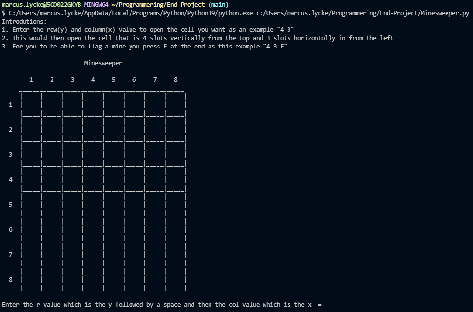
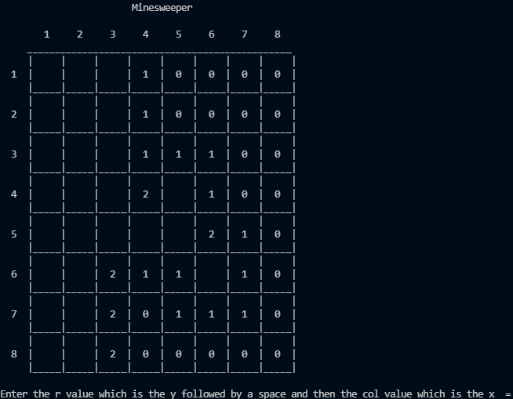
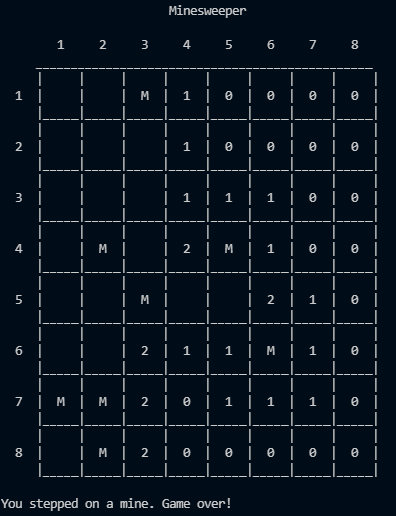

# MineSweeper

## Beskrivning

*** Mitt project är ett minesweeper spel som tanken är att andra personer ska kunna köra. Projectet är skrivet i python.

## Teknologier

*** Mitt program är byggt med pyhon samt har jag också importerat os för att använda till en clearing funktion och random för att slumpvist välja vilka platser jag ska placera ut minor på.

## Krav

*** Python 3.9.5 +

## Kodkonvention

*** Mitt program och kommentarer är skrivna på engelska samt är utlagda på alla funktioner och en del finns också på andra ställen. I mitt program efterföljs även pep 8.

## Hur det fungerar

*** def create_mines():

    global minesweeper
    global amount_mines
    global n
 
    # Track the amount of mines already set up
    count = 0
    while count < amount_mines:
 
        # A random number out of all the grid positions possible
        val = random.randint(0, n*n-1)
 
        # Generating the row and column of that specific number
        r = val // n
        col = val % n
 
        # Place the mine, if there isn't one there already
        if minesweeper[r][col] != -1:
            count = count + 1
            minesweeper[r][col] = -1

## Exempelkörning

*** 
*** 
*** 

## Att göra

- [] Olika svårighetsgrader
- [] ändra input ordningen för x och y

### Version 1 i jämförelse med version 2

#### Tillagt

- Instruktioner
- clearing funktion
- Om du trycker på en cell med 0 som värde så öppnas de andra celler runt omkring som är noll samt de runt de sålänge de ej är minor

#### Borttaget

- Olika svårighetsgrader

## Att bidra

*** Då bedömning ännu ej är gjord på uppgiften så tillåts inga pull requests. Så fort bedömning är gjord kommer detta tillåtas.  

Vid större förändringar önskar jag att en issue öppnas för diskussion om vad som ska förändras.

## Licens

[MIT](https://choosealicense.com/licenses/mit/)

## Kontakt

marcus.lycke@elev.ga.ntig.se

https://github.com/Mackan444/MineSweeper

## Erkännanden

- Hur man kan skapa en grid
